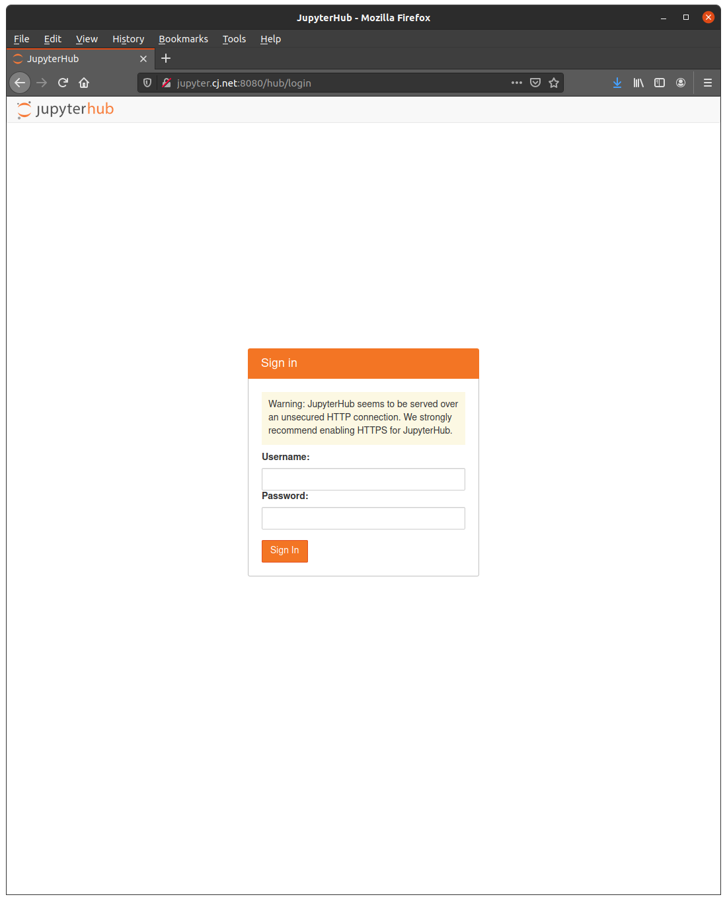
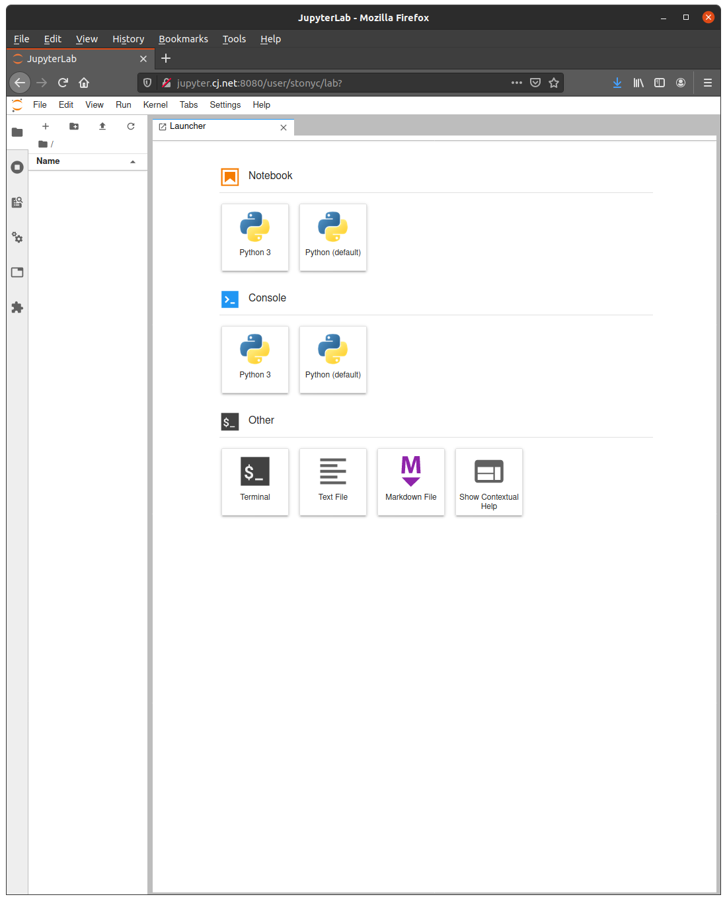
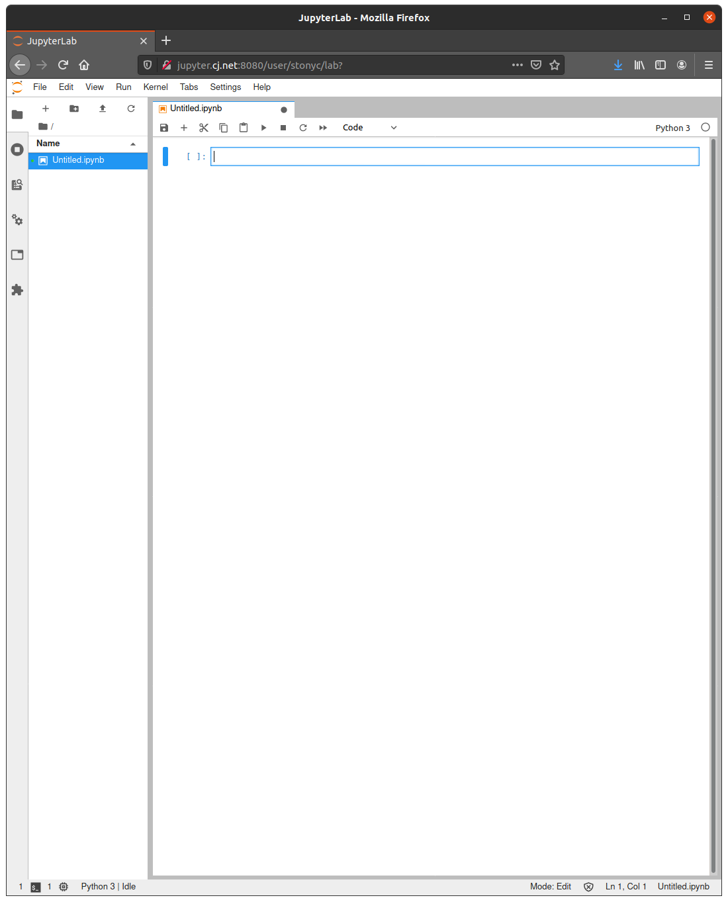
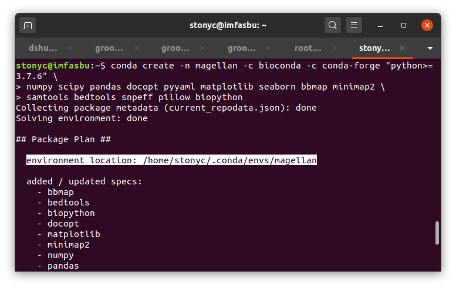

### **Before You Begin**

**Please note the following:**

* Please use the `sudo` command listed below very carefully, `sudo` gives you `superuser` privileges on the server. **With great power, comes great responsibility!**
* Please do not save new `Jupyter Notebooks` to your `/home` directory, instead all notebooks should be saved to your `data/` directory.
* Finally, please try not to save files or install programs to your `/home` directory. Storage space should be used wisely because we have many users.

##### **`Quick Start`**

Open a web browser (`Chrome` or `Firefox`) and go to: <a href="http://jupyter.cj.net:8080" target="_blank">**`http://jupyter.cj.net:8080`**</a> (or click to open in a new window).


##### **`Create Account`**

Enter your preferred username and password:



You will then be taken to the following page:



##### **`Jupyter Hub`**

On this page, you can do the following:

* Start a new `Terminal` window to access the `imfasbu` server `52.70.50.41`
* Start a new `Jupyter Notebook` using the provided `conda` environments
* Start a `Python Console` to access `Python` directly
* Create a new `Text File` or `Markdown File`

##### **`Jupyter Notebook`**

Let's create a new `Jupyter Notebook`, click on the box labeled `Python (default)`:



This `Python (default)` notebook provides access to the following common packages:

```
numpy
scipy
pandas
tensorflow
keras
scikit-learn
plotly
matplotlib
seaborn
```

##### **`Create Custom Notebooks`**

To create customized notebooks with access to different packages, you must open a `Terminal` window and enter the following (add your desired `Anaconda` channels and `packages`). For example, let's create a new `conda` environment for [`MAGELLAN`](http://gitlab.cj.net/it/magellan).

First create the new environment:

```bash
conda create -n magellan -c bioconda -c conda-forge "python>=3.7.6" \
numpy scipy pandas docopt pyyaml matplotlib seaborn bbmap minimap2 \
samtools bedtools snpeff pillow biopython ipykernel
```

**NOTE**: ALL CUSTOM ENVIRONMENTS MUST INCLUDE `ipykernel`

Make a note of where the new environment was saved:



When finished, enter the following command to add the environment to your `Jupyter` hub, and enter your server password (not `Jupyter` password) when prompted. Be sure to replace `/home/stonyc/.conda/envs/magellan` with the path to your new `conda` environment:

```bash
sudo /home/stonyc/.conda/envs/magellan/bin/python -m ipykernel install --name 'Magellan' --display-name "Magellan"
```

You may be required to logout and login to `Jupyter`, but you should now see something similar to the followin in your `Jupyter` hub:


You can now access a new `Jupyter Notebook` with your customized packages!
